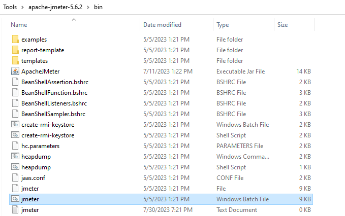
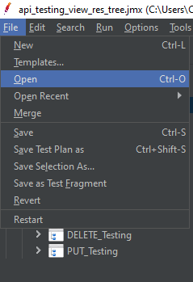
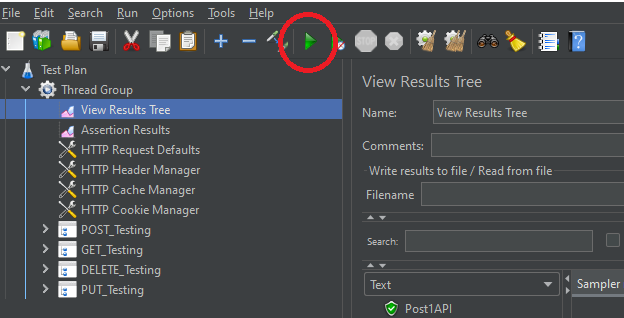

# Mobile Flask Restful API
# Documentation

This is an implementation and testing of a REST-based application able to store and show information about [mobile phones](https://www.nokia.com/phones/en_au/smartphones) using [Flask](https://pythonbasics.org/what-is-flask-python/) and [JMeter](https://jmeter.apache.org/) technologies.

In this particular task, only the following fields were considered: object (name, brand, year of release, operating system).

## Contents
- [Build and Use the application?](#build_and_use_the_application)
- [Testing](#testing)
- [Deployment](#deployment)

# Build and Use the application? <a name = "build_and_use_the_application"></a>

## Setup

The following the tutorial on how to install Flask Framework: https://flask.palletsprojects.com/installation/

## Run

Run the python application using the command:

```shell
python3 app.py
```

# API

## Description
This is an API that allow to perform `GET`, `POST`, `PUT` and `DELETE` HTTP request methods to Mobile phones.

## Base URL of the application
```
BASE URL http://<localhost>:<port>/phone_store/
```

Most probably the port will be 5000.

## Features
- [Add new phone](#add_new_phone)
- [Query phone information](#query_phone_information)
- [List phones](#list_phones)
- [Delete phone](#delete_phone)

### Add new phone <a name = "add_new_phone"></a>

### Endpoint
```
POST http://<localhost>:<port>/phone_store/
```
Inserts a new phone to the database if no error is encountered.

### Error cases:
Error code operations for adding new phone:
- `409 Conflict`: Duplicate phone now allowed.
- `422 Unprocessable Entity`: Parameters not passed correctly or malformated.
- `400 Bad Request`: In case any other error occur.

### Query phone information <a name = "query_phone_information"></a>

### Endpoint
```
GET http://<localhost>:<port>/phone_store/<id>
```
Gives back the phone with specific ID in `JSON` format.

### Error cases:
Error code operations for adding new phone:
- `404 Not Found`: ID not found in the database
- `400 Bad Request`: In case any other error occur.


### List phones <a name = "list_phones"></a>

### Endpoint
```
GET http://<localhost>:<port>/phone_store/
```

List all phones stored in the database in `JSON format`. Code `200 - OK` is returned to represent sucessfull operation. 

### Delete phone <a name = "delete_phone"></a>

### Endpoint
```
DELETE http://<localhost>:<port>/phone_store/<id>
```
Delete from the database the phone with specific ID in `JSON format`.

### Error cases:
Error code operations for delete operations:
- `404 Not Found`: ID not found in the database
- `400 Bad Request`: In case any other error occur.

## Testing <a name = "testing"></a>

The goal of this plan is to test the application based It's specification either in MASTER and LEVEL SPECIFIC TEST plan using the `IEEE 829 Standard`.

### Plan

### Test Items
We are testing all the features the application can perform (complete CRUD).

### Software Risk Issues
By adding more than 10^8 items in our database, the application tends to load all the mobile phones slowly due to the complexity and ammount of data which might lead to a bug.

### Features to be tested

| Syntax      					| Level	|
| :---------------------------: | :---: |
| Add 1 mobile phone      		| H     |
| Add another mobile phone   	| M    	|
| List all mobile phones   		| H     |
| Show only the 2nd added   	| H     |
| Delete the first   			| H     |
| List all mobile phones   		| L     |
| Delete all mobile phones   	| H     |
| List again  					| L     |
| Show the 1st mobile phone   	| L     |

On risk levels, H - High; M - Medium; L - Low

### Features not to be tested
`404` - Bad requests are not going to be tested.

### Strategy
For this task, [Apache JMeter](https://jmeter.apache.org/) is the testing software recommended to be used. Please check out [JMeter Getting Started](https://jmeter.apache.org/usermanual/get-started.html) to learn in case needed.

There will be about 4 regression tests. We use "Retest all" and "Regression test selection".

At MASTER LEVEL is expected all functionality work perfect.

Please, be noticed that first we try to test small test cases and then move bigger ones so that when get finished we create the full lifecycle tests.

### Item pass/fail criteria
#### Unit test level
Similar test cases can be found on the file
Tests:

When running the test cases using the current version, `all test cases completed` are expected as output.

### Suspension criteria and resumption requirements
It is only allowed an upper bound of 50% of defects. More than that, It is recommended to have a deep check on the solution provided before rerun the test cases.

### Test Deliverables
As part of this plan, we deliver:
- Test plan document
- Test cases
- Test Design specifications
- Tools and their ouputs

### Remaining test tasks
No more test cases are listed up to this release documentation date.

### Environmental needs
We recommend to run the application and test software using:
- Minimum RAM 4G
- 10 GB available disk space
- [Ubuntu 20.04.6 LTS](https://releases.ubuntu.com/focal/)
- [Apache JMeter 5.6.2](https://dlcdn.apache.org//jmeter/binaries/apache-jmeter-5.6.2.zip)
- [Java 8+](https://www.java.com/download/ie_manual.jsp)
- [Python3](https://www.python.org/downloads/)
- [Flask](https://flask.palletsprojects.com/en/2.3.x/installation/)

### Staffing and training needs
In case of any questions, please contact `Alfredo Martins`.
Many resources can be used to learn how to use all the tools mentioned; Some links were left to help on training.

### Responsibilites
`Alfredo Martins` is in charge of everything related to this task.

### Schedule
This work was done in no more than `7 days` using a flexible time schedule.

### Planning risks
Skipped

### Approvals
Skipped

### Test plans
Download the [test plan](https://github.com/CodeTyperPro/phone-task-testing/blob/main/testing/api_testing_view_res_tree.jmx) and import it on JMeter in order to test the running application.

Before start, [configure](https://www.guru99.com/guide-to-install-jmeter.html) your JMeter.

Now please follow the steps:
1. Open JMeter:
<br>


<br>

1. Click at `File > Open` or `Ctrl + O`:
<br>


<br>

Then find the `api_testing_view_res_tree.jmx` file and import it.
<br>

1. Run the test cases. Click the `GREEN` button `highlighted`:
<br>


<br>

### Description

Order level: 
```
- Fragment
    - Test case
```

<br>

PRE_PHASE_Testing
- GetAllEmptyAPI: checks non-existence of item.

---

POST_Testing
- Post1API: adds the 1st entry to the database sucessfully.
- Post2API: adds the 2nd entry to the database sucessfully.
- Post1AlreadyExistsAPI: try to insert the 1st entry again and fails consequently.
- PostMore20API: adds sucessfully 20 more entries loading from a `CVS` file.

--- 
GET_Testing
- GetAllAPI: Query all mobile phone entries added.
- GetSingleAPI: Checks existence of a specific mobile ID in the database. 
- GetSingleNotFoundAPI: Checks non-existence of an ID.

---

DELETE_Testing
- DeleteAPI: remove a mobile phone in the database in case it exists.
- DeleteNotFoundAPI: tries to delete a mobile phone not presented in the database.

---

PUT_Testing
- PutAPI: asserts for a modification of a mobile data specifying the ID.
- PutNotFoundAPI: tries to modify a mobile data not presented int he databse.

## Deployment <a name = "deployment"></a>